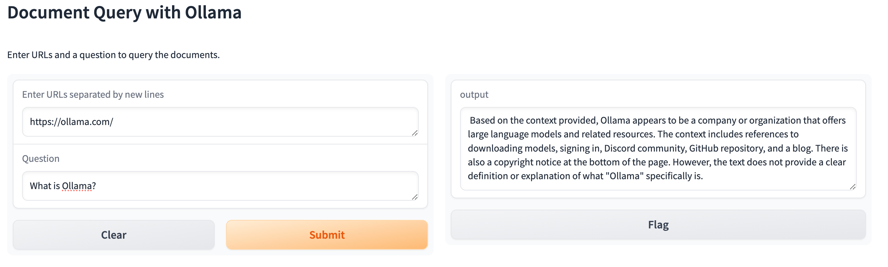

# RAG with Ollama and LangChain via Gradio Interface

This repository hosts the implementation of a Retrieval-Augmented Generation (RAG) project leveraging the capabilities of Ollama to run open-source large language models (LLMs) locally, alongside LangChain for robust integration of language models with data retrieval functionalities. A Gradio interface is provided for easy and interactive user engagement.

## Overview

Retrieval-Augmented Generation (RAG) combines the generative strengths of large language models with advanced information retrieval techniques to produce contextually rich and accurate outputs. This project showcases the power of RAG in various domains such as question answering, content creation, and data synthesis, by harnessing the latest in language modeling and retrieval technologies through Ollama and LangChain.

## Features

- **Ollama Integration:** Uses Ollama to locally run various open-source large language models, including Llama 2 and Code Llama, offering state-of-the-art language understanding and generation.
- **LangChain for Efficient Retrieval:** Implements LangChain for effective retrieval of pertinent information from diverse data sources, enhancing the models' output with real-time data.
- **Interactive Gradio Interface:** Provides a Gradio-based web interface for real-time user interaction, making it straightforward for both technical and non-technical users to input queries and receive responses.
- **Flexible Framework:** Designed for easy extension across different use cases and data sets, facilitating broad applicability.

## Getting Started

### Prerequisites

- Python 3.8+ and `pip3` installed on your system.

### Installation

1. Ensure python version

```shell
$ python3 -V
Python 3.6.8

## 默认安装版本不符合要求，卸载
$ yum remove -y python3 python3-devel python3-pip

## 重新安装
$ yum install -y centos-release-scl centos-release-scl-rh
$ yum list | grep python3

## 注意，由于公钥下载失败会导致某些包无法安装，进而中止整个安装过程，因此，禁用了公钥检查
$ yum install -y rh-python38 --nogpgcheck

$ vim ~/.bashrc
## 添加如下行
source /opt/rh/rh-python38/enable

## 执行生效
$ source ~/.bashrc

$ python3 -V
Python 3.8.13
```

2. Clone the repository:

```bash
git clone https://github.com/your-username/rag-project-with-ollama-and-langchain.git
cd rag-project-with-ollama-and-langchain
```

3. Install required Python packages:

```bash
## 确认protobuf版本
$ pip3 show protobuf
$ pip3 install protobuf==4.21.0

## 用于替换sqlite3，详情参考app.py
$ pip3 install pysqlite3-binary

## 安装依赖
$ pip3 install -r requirements.txt
```

4. urllib3 requirements

Error with running:

```shell
ImportError: urllib3 v2 only supports OpenSSL 1.1.1+, currently the 'ssl' module is compiled with 'OpenSSL 1.0.2k-fips  26 Jan 2017'. See: https://github.com/urllib3/urllib3/issues/2168
```

重新安装特定版本的urllib3：

```shell
## 1. 卸载当前版本
pip3 uninstall urllib3
## 2. 指定版本重新安装
pip3 install urllib3==1.26.15
```

### Running the Application

1. **Start the Gradio web interface:**

```bash
python app.py
```

Gradio will then launch the web server, providing a local URL to access the interactive interface.

## Usage

- Open the Gradio interface URL in your web browser.
- Enter your query in the designated text field(URLs and Question).
- Hit the "Submit" button to send your query.
- The generated response, enriched with retrieved information, will be displayed on the interface.



## Contributing

Contributions are welcome! Feel free to submit pull requests with new features, bug fixes, or enhancements.

## License

This project is released under the MIT License. See the [LICENSE](LICENSE) file for more details.

## Acknowledgments

- The Ollama team for enabling local execution of open-source large language models.
- LangChain for their innovative approach to integrating language models with information retrieval systems.
- Gradio for their user-friendly interface for machine learning models.

## Contact

For inquiries or discussions, please open an issue in the repository, and we will respond as soon as possible.
